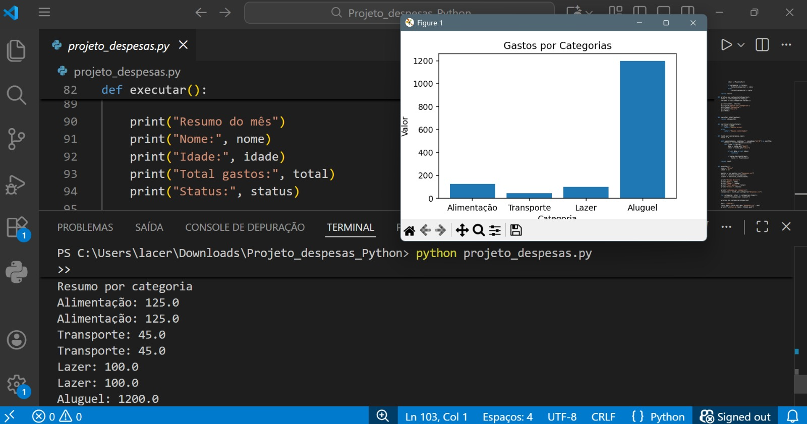

# 📊 Análise de Despesas Pessoais com Python (v2.0)

Projeto desenvolvido como evolução de um primeiro projeto de análise de despesas,
com foco em prática real, organização de código e construção de portfólio para GitHub e LinkedIn.

Este projeto representa a **versão 2.0**, com melhorias na estrutura, leitura de dados,
análises mais completas e visualização gráfica.

---

## 🎯 Objetivo do projeto

Analisar despesas pessoais a partir de um arquivo CSV, realizando:

- Leitura e tratamento de dados
- Cálculo do total de gastos
- Análise por categoria
- Análise por mês
- Visualização gráfica dos gastos por categoria

---

## 🛠️ Funcionalidades

- Leitura de dados a partir de `despesas.csv`
- Agrupamento automático por categoria
- Cálculo do total mensal
- Geração de gráfico com Matplotlib
- Código organizado em funções reutilizáveis

---

## 📈 Visualização

Exemplo de gráfico gerado pelo projeto:



---

## ▶️ Como executar o projeto

1. Certifique-se de ter o Python instalado
2. Instale a biblioteca necessária (se ainda não tiver):

```bash
pip install matplotlib

