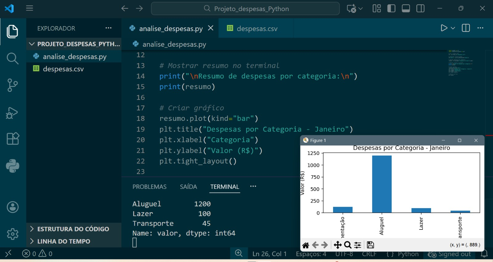

# 📊 Análise de Despesas Pessoais com Python

## 📌 Descrição
Projeto simples de análise de despesas pessoais utilizando Python, com foco em leitura de dados, tratamento de datas, agrupamento por categoria e visualização gráfica.

## 🛠️ Tecnologias utilizadas
- Python
- Pandas
- Matplotlib
- VS Code

## 📂 Estrutura do projeto
- analise_despesas.py → script principal
- despesas.csv → base de dados
- imagens/ → imagens do projeto

## 📈 Resultado
O projeto gera um resumo das despesas por categoria e um gráfico de barras para visualização dos gastos.

## 🚀 Próximos passos
- Melhorar visualização do gráfico
- Adicionar novas categorias
- Evoluir para dashboards

